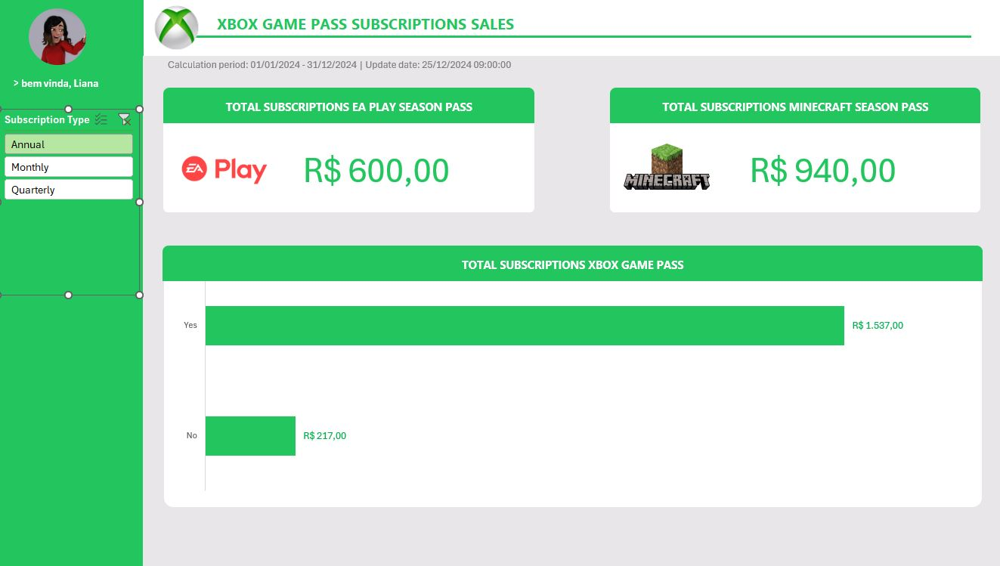

# Dashboard de Vendas no Excel

## Descrição do Projeto
Este projeto consiste na criação de um **dashboard de vendas** no Excel, transformando dados brutos em informações visuais claras e útis. O objetivo é facilitar a análise do desempenho de vendas e apoiar a tomada de decisões.

## Estrutura do Repositório
- `dashboard-xbox.xlsx` - Arquivo Excel contendo o dashboard finalizado.
- `README.md` - Documentação do projeto.
- `dados/` - Pasta opcional para armazenar arquivos de dados brutos (se aplicável).

## Funcionalidades do Dashboard
- **Resumo Geral**: Receita total, total de assinantes e ticket médio.
- **Vendas por Tipo de Plano**: Comparativo de receita por plano (Core, Standard, Ultimate).
- **Evolução das Vendas**: Gráfico de linha mostrando a receita mensal.
- **Renovação Automática**: Distribuição dos assinantes com e sem renovação.
- **Impacto dos Cupons**: Análise dos descontos aplicados.
- **Passes Extras**: Proporção de assinantes que adquiriram passes EA Play e Minecraft.

## Como Utilizar
1. Baixe o arquivo `dashboard-xbox.xlsx`.
2. Abra no Microsoft Excel (versão 2016 ou superior recomendada).
3. Navegue entre as planilhas para explorar os dados e visualizações.

## Tecnologias Utilizadas
- **Microsoft Excel** - Para manipulação de dados e criação do dashboard.
- **Fórmulas do Excel** - `SOMASE`, `CONT.SE`, `TABELA DINÂMICA`.
- **Gráficos** - Linhas, colunas e pizza.

## Instruções para Reprodução
1. Certifique-se de ter os dados em um formato adequado.
2. Utilize as fórmulas indicadas para gerar os cálculos.
3. Insira os gráficos conforme descrito.

## Autor
Projeto desenvolvido por VBDOL.DEV.

